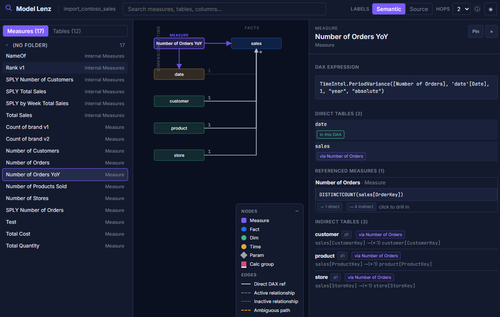

# Model Lenz

*One graph, two readings. The same Power BI model — told in PBIP names for the BI developer and source-system names for the data engineer. Pick a measure, see every table it really depends on.*

[](https://pypi.org/project/model-lenz/)
[](LICENSE)
[](https://www.python.org/downloads/)
[](https://github.com/sponsors/JonathanJihwanKim)
[](https://www.buymeacoffee.com/jihwankim)
[](https://mvp.microsoft.com/en-us/PublicProfile/5005958)

**If Model Lenz saves you a model review, sponsor a few minutes back:**

[](https://github.com/sponsors/JonathanJihwanKim)
[](https://www.buymeacoffee.com/jihwankim)

---

## Try it in 30 seconds (no clone needed)

```bash
uv tool install model-lenz       # or: pipx install model-lenz
model-lenz demo                  # opens a built-in 5-table demo in your browser
```

> **Nothing to clone. Nothing to download from GitHub.** The wheel ships the CLI, a pre-built React UI, and a tiny demo PBIP.

The demo is a hand-authored 5-table model (Date, Customer, Product, Sales_fct, Measure). When the browser opens:

1. Click **Margin %** in the left sidebar — watch the dashed edges light up across all three dimensions, even though the expression only mentions other measures.
2. Toggle **Semantic ↔ Source** in the header — the same graph re-reads in BigQuery / Snowflake / SQL table names.

Got your own PBIP folder? Continue to [Install](#install).

---

## Install

You only need Python 3.10+. Pick whichever installer you have — they all end with the same `model-lenz` command on your PATH.

> **Do I need to clone the repo?** **No.** Installing from PyPI gives you the full tool, including the bundled `model-lenz demo`. Clone the repo only if you want to contribute code or read the source.

### Windows (PowerShell) — three steps

**Step 1.** Install `uv` (Astral's installer — one-time, ~10 seconds):

```powershell
powershell -ExecutionPolicy ByPass -c "irm https://astral.sh/uv/install.ps1 | iex"
```

You only do this once per machine. If `uv --version` already prints something, skip it.

**Step 2.** Install Model Lenz as a global tool:

```powershell
uv tool install model-lenz
```

This downloads the latest `model-lenz` wheel from PyPI and registers a `model-lenz` command on your PATH (in `~\.local\bin\`). No clone, no Python project setup.

**Step 3.** Open a *new* PowerShell window (so the PATH update is picked up), then run:

```powershell
model-lenz serve "C:\projects\Sales\Sales.SemanticModel"
```

Replace the path with your `*.SemanticModel/` folder — the one Power BI Desktop creates next to your `.pbip` file. The browser opens automatically.

- *Path has spaces?* Wrap it in double quotes: `model-lenz serve "C:\My Reports\Q4 Sales\Q4 Sales.SemanticModel"`.
- *Prefer pointing at the PBIP root?* That works too — Model Lenz auto-detects the `*.SemanticModel/` child. See [Point it at your PBIP folder](#point-it-at-your-pbip-folder).

### macOS / Linux — three steps

**Step 1.** Install `uv`:

```bash
curl -LsSf https://astral.sh/uv/install.sh | sh
```

Skip if you already have `uv`. If you have `pipx` and prefer it, you can use `pipx install model-lenz` in step 2 instead.

**Step 2.** Install Model Lenz as a global tool:

```bash
uv tool install model-lenz
```

**Step 3.** In a new shell session, run it against your `*.SemanticModel/` folder:

```bash
model-lenz serve path/to/Sales.SemanticModel
```

### Already have Python and just want it in your environment?

```bash
pip install model-lenz
```

(Not recommended — `uv tool` / `pipx` keep `model-lenz` isolated from your project Pythons.)

### Updating to a newer version

When a new release lands on PyPI, your installed `model-lenz` will keep running the older version until you upgrade it. One command does it:

```powershell
uv tool upgrade model-lenz
```

(macOS/Linux: same command. With pipx: `pipx upgrade model-lenz`.)

After upgrading, **fully close the existing model-lenz browser tab and stop any running server** (Ctrl+C in the terminal). Then run `model-lenz serve` again. Your browser should pick up the new bundle automatically; if it doesn't, hit **Ctrl+F5** (or **Cmd+Shift+R** on Mac) to force-refresh past the cached JavaScript.

To confirm which version you have:

```powershell
model-lenz version
```

---

## Point it at your PBIP folder

PBIP saves your project as a folder tree:

```
Sales\                                      ← the PBIP root (what Power BI Desktop opens)
  Sales.pbip                                ← the project file
  Sales.SemanticModel\                      ← the model — point here
    definition\
      tables\*.tmdl
      relationships.tmdl
      expressions.tmdl
  Sales.Report\                             ← report layer (PBIR). Not used by Model Lenz —
                                              see PBIP Lineage Explorer for visual lineage.
```

`model-lenz serve` accepts any of these three paths and they all parse the same model:

| Path you pass                                       | Works? | Notes                                     |
|-----------------------------------------------------|--------|-------------------------------------------|
| `Sales\Sales.SemanticModel`  *(the model folder)*   | ✅ recommended | The folder Model Lenz actually reads. |
| `Sales`  *(the PBIP root, containing `Sales.pbip`)* | ✅      | Also works — Model Lenz locates the `.SemanticModel/` child automatically. |
| `Sales\Sales.SemanticModel\definition`              | ✅      | The innermost folder still works.        |

---

## Troubleshooting

- **"`pipx` is not recognized" on Windows.** Use `uv tool install` instead (see [Install](#install)) — `uv` is a single-binary installer and doesn't need pip.
- **`model-lenz` isn't found after install.** Open a *new* terminal window. The installer added a directory (`~/.local/bin` on Linux/macOS, `%USERPROFILE%\.local\bin` on Windows) to your PATH, but existing terminals don't see it until they restart.
- **Browser doesn't open automatically.** It prints the URL — copy `http://127.0.0.1:<port>/` into your browser. Add `--no-browser` to suppress the auto-open.
- **"Address already in use".** Pick a port: `model-lenz serve … --port 8765`.

---

## CLI

```text
$ model-lenz --help

Usage: model-lenz [OPTIONS] COMMAND [ARGS]...

  Open-source PBIP analyzer.

Commands:
  demo      Serve the bundled tiny demo PBIP — no path or clone needed.
  inspect   Parse a PBIP and print the parsed model as JSON.
  serve     Start the local web server and open the model in a browser.
  summary   Print a one-screen human summary of the parsed model.
  version   Print the Model Lenz version.
```

- `model-lenz demo` — the fastest way to see what the tool does. No path, no clone — uses a bundled 5-table model.
- `model-lenz serve <pbip>` — the main experience on your own model: local web app + interactive graph.
- `model-lenz summary <pbip>` — counts, classification breakdown, lineage confidence — useful for CI.
- `model-lenz inspect <pbip> -o model.json` — full parsed model as JSON. Plug it into other tools.

---

## Who is this for?

Model Lenz is built for the two people who keep looking at the same Power BI model from opposite sides of the same wall.

### Power BI developers

Click any measure and the graph lights up with:

- **Direct table refs** (solid edges) — parsed straight from the DAX expression.
- **Indirect tables** (dashed edges, with `*:1` / `1:*` / `↔` glyphs) — every table the measure transitively touches through active relationships.
- **`USERELATIONSHIP(...)` overrides** honored per-measure.
- Calculation groups, calculated columns, and User Defined Functions all included.

Catches the *"this measure only mentions Sales but breaks the moment someone slices by Date"* class of bug before review.

### Data engineers

Flip the global **Semantic ↔ Source** toggle. Every PBIP table label swaps to its source-system identifier — `report_sales.fact_orders_combined` on BigQuery, `dbo.DimCustomer` on SQL Server, the full Snowflake path, the SharePoint URL — with confidence labels for each resolution. Per-partition M-query lineage including native SQL.

> Both views are the same graph. That's the point — when you talk to each other in a PR or a Slack thread, you are not pointing at different pictures.

---

## What it does

When a Power BI developer writes `Total Sales = SUM ( Sales[Amount] )`, the measure technically references only `Sales`. But anyone slicing the report by `Customer` or `Date` is also affecting the result, because filters propagate through active relationships. **Model Lenz makes those implicit dependencies explicit** — direct table refs (parsed from DAX), referenced measures (resolved transitively), indirect tables (walked through active relationships with cardinality + `USERELATIONSHIP` overrides), and per-table source-system lineage with confidence labels.

---

## Features

| | |
|---|---|
| **PBIP format** | TMDL semantic model only (no legacy `.pbix` in v1). Reads `definition/tables/*.tmdl`, `definition/relationships.tmdl`, `definition/expressions.tmdl`, `definition/functions/*.tmdl`. |
| **DAX coverage** | Measures · User Defined Functions (preview syntax) · calculated columns · calculation groups · `USERELATIONSHIP` hints · table-arg DAX functions (FILTER, ALL, CALCULATETABLE, …) |
| **Power Query** | Per-partition lineage. Connectors: `GoogleBigQuery`, `Sql.Database`, `Snowflake`, `AzureStorage`, `Csv.Document`, `Excel.Workbook`, `Web.Contents`, `SharePoint`, `OData`, `Json.Document`. Resolves cross-query references to surface the deepest known source. |
| **Relationships** | Active and inactive, all four cardinalities, single and bidirectional crossfilter. Walker honors filter-propagation direction and re-enables inactive relationships when a measure declares `USERELATIONSHIP(…)`. |
| **Classification** | Heuristic fact / dim / parameter / time / calc-group / other, configurable via a `model_lenz.toml` in the PBIP root. |
| **Distribution** | Single Python wheel — install via `uv tool install model-lenz` (recommended) or `pipx install model-lenz`. Frontend bundle is included; no Node required at install time. |
| **Read-only** | Model Lenz never modifies your PBIP files. |

---

## Roadmap

Model Lenz exists because Power BI developers and data engineers need to look at the **same** model and have the **same** conversation about it. Everything on this roadmap serves that handshake — surfacing model changes early, in a vocabulary both sides recognize, on a surface both sides can review.

- **v0.2 — Shared review surfaces.**
  - Calculation groups in the graph view; calc-column visualizations.
  - **Shareable URLs** that capture the selected measure, Semantic/Source toggle state, and walk depth — paste a link into a PR or Slack thread and both sides land on the exact same view. No more "which view are you looking at?"
  - **Export to Mermaid / SVG** for embedding sub-graphs in pull requests and design docs.

- **v0.3 — Change-impact conversations.**
  - **PBIP diff view** — point Model Lenz at two refs (`main` vs `feature/x`) and see which measures' direct *and indirect* table-dependency sets changed. Lets a data engineer preview which BI measures break before renaming a source column; lets a BI developer show a data engineer exactly which warehouse tables a new measure now reaches.
  - **Per-measure / per-table Markdown handoff cards** — one-pager exports a BI developer can paste into Jira, Slack, or a PR description when asking the data engineer about a specific column or relationship.

- **v0.4 — Guardrails before the merge.**
  - **`model-lenz check` for CI** — extend `summary` into a policy-gate command that can fail a build on orphan measures, fact tables sourced from more than one warehouse, ambiguous propagation paths through multiple facts, or measures whose indirect-table set grew by more than N tables in a single commit. Catches anti-patterns at PR time, before they become a review thread.
  - **Annotation layer on sub-graph exports** — reviewers leave inline comments on an exported SVG/Mermaid sub-graph attached to a PR.

- **Later.** DMV / XMLA mode for deployed semantic models. `.pbix` adapter. Perspective-aware views. Bus-layout (Kimball-style dims-top / facts-left) auto-arrangement for star-schema review.

> **Not on this roadmap by design:** report-layer (PBIR) measure-usage — *which pages and visuals consume each measure*. That's exactly what **[PBIP Lineage Explorer](https://github.com/JonathanJihwanKim/pbip-lineage-explorer)** is for. Use Lineage Explorer for visual → DAX → source-column tracing; use Model Lenz for the model-side dependency picture.

Have something else you'd like to see? Open a [feature request](https://github.com/JonathanJihwanKim/pbip_model_lenz/issues/new?template=feature_request.yml).

---

## Also by Jihwan Kim

- **[PBIP Lineage Explorer](https://github.com/JonathanJihwanKim/pbip-lineage-explorer)** — Trace any visual back to its source columns through DAX. Browser-based, 100% client-side. Use this when the question is *"where does the number on this card actually come from?"*
- **[PBIP Documenter](https://github.com/JonathanJihwanKim/pbip-documenter)** — Generate bidirectional documentation (measures, tables, relationships, M-steps, native SQL) from PBIP/TMDL in seconds. Use this when the question is *"can I hand someone a readable spec of this model without writing one?"*

Together with Model Lenz, the three tools cover the model side, the report side, and the documentation side of a PBIP project without overlap.

---

## Architecture (for contributors)

```
                           ┌───────────────────┐
   .tmdl, .pq files  ───▶  │  Python backend   │  ◀── HTTP /api  ───┐
   in your PBIP            │  parsers /        │                    │
                           │  analyzers /      │   ┌──────────────────┐
                           │  FastAPI          │   │ React + Vite SPA │
                           └───────────────────┘   │ D3 force graph   │
                                  ▲                │ Zustand store    │
                                  │                └──────────────────┘
                           model-lenz CLI
                          (typer + uvicorn)
```

- **Parser layer** ([`src/model_lenz/parsers/`](src/model_lenz/parsers/)) — TMDL block parser (indent-aware state machine), DAX reference extractor (hand-rolled tokenizer), M-query lineage extractor (recursive descent with native-SQL parsing).
- **Analysis layer** ([`src/model_lenz/analyzers/`](src/model_lenz/analyzers/)) — relationship graph + indirect-dep walker on NetworkX, transitive measure resolver, fact/dim classifier.
- **JSON contract** ([`src/model_lenz/models/`](src/model_lenz/models/)) — Pydantic models that the API serializes and the frontend mirrors as TypeScript types.
- **HTTP API** ([`src/model_lenz/api/routes.py`](src/model_lenz/api/routes.py)) — FastAPI; full OpenAPI at `/docs`.
- **Frontend** ([`frontend/`](frontend/)) — React 18 + Vite + TypeScript; force graph in D3 directly (no Cytoscape); Zustand for state.

See [CONTRIBUTING.md](CONTRIBUTING.md) for a deeper tour.

### From source

```bash
git clone https://github.com/JonathanJihwanKim/pbip_model_lenz
cd pbip_model_lenz
uv pip install -e ".[dev]"
cd frontend && npm install && npm run build && cd ..
model-lenz serve examples/tiny_pbip
```

---

## FAQ

**Does Model Lenz modify my PBIP?**
No. It only reads. All processing is in-memory; nothing is written back to the model files.

**Does it need an XMLA endpoint or live AS connection?**
No. It works purely from the PBIP source files on disk. Source control is the only prerequisite — no Power BI Service or Tabular Editor required.

**What about legacy `.pbix` files?**
Not supported in v1. `.pbix` is a zipped legacy bundle; the TMDL-based PBIP format is the going-forward source-of-truth and supersedes it. If there's strong demand, a `.pbix` adapter could land in a later release.

**Does it scan my report visuals?**
No. Model Lenz reads only the `.SemanticModel/` side of a PBIP. For tracing which pages and visuals consume each measure — visual → DAX → source column — use **[PBIP Lineage Explorer](https://github.com/JonathanJihwanKim/pbip-lineage-explorer)**.

**Does it execute DAX or run queries?**
No. It's purely static analysis — lexical parsing of expressions, walking the relationship graph. Nothing connects to a real data source.

**Why isn't the indirect-table list deeper by default?**
Default walk depth is 2 hops, which captures the typical star or snowflake. Adjust via the depth selector in the header or `?depth=` on the API.

---

## Support development

Model Lenz is free, ad-free, and never phones home — every parser, walker, and graph runs on your machine. If it has saved you time on a model review, an audit, or a *"wait, where does this column actually come from?"* conversation, consider sponsoring development:

- **[❤ GitHub Sponsors](https://github.com/sponsors/JonathanJihwanKim)** — recurring $2 / $5 / $10 / $25 / $50 per month. Top tier includes a 30-minute monthly call with a Microsoft MVP.
- **[☕ Buy Me a Coffee](https://www.buymeacoffee.com/jihwankim)** — one-time contributions, any amount.

Sponsorship funds: new connector parsers (Snowflake-native-SQL, Databricks, Synapse), CI-mode policy gates, and v0.3 PBIP-diff work.

[](https://github.com/sponsors/JonathanJihwanKim)
[](https://www.buymeacoffee.com/jihwankim)

### Hall of Sponsors

*Your name here — sponsor at the $10+ tier and you'll be listed (with your consent) here on the README and on the project website.*

---

## License

[MIT](LICENSE) — use it commercially, fork it, ship it inside whatever you're building. Attribution appreciated but not required.
